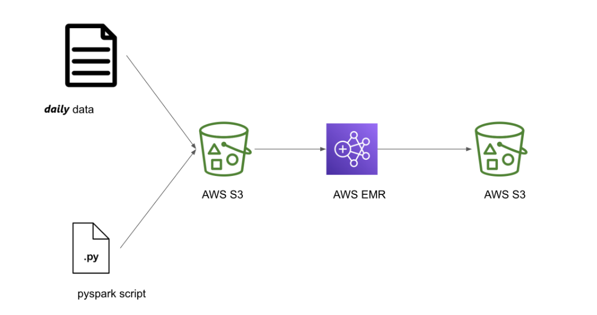

**Project Overview: AWS Orders Daily Processing Pipeline**

**Project Name:** AWS Spark Orders Pipeline

**Description:** This project aims to automate the daily processing of order data using Apache Airflow and AWS services. The pipeline uploads order data and Spark job scripts to an S3 bucket, creates an EMR (Elastic MapReduce) cluster to execute the Spark job, and manages the lifecycle of the cluster.

### Architecture Diagram

**Project Screenshots**
- Airflow

- Spark Code

- Raw Data File 

- Starting Cluster

- Executing Spark Job

- Processed Data

-----
**Key Components:**

1. **DAG Configuration:**
   1. **DAG ID:** AWS\_SPARK\_ORDERS\_PIPELINE
   1. **Schedule:** Daily execution (once every day)
   1. **Start Date:** Date Information
   1. **Catchup:** Disabled (only runs on the scheduled date)
1. **Parameters:**
   1. **Execution Date:** The date for which the orders are being processed (formatted as yyyymmdd).
   1. **S3 Bucket Name:** The bucket where order data and Spark code are stored.
1. **AWS Connection:**
   1. Uses AWS credentials (access key and secret key) fetched from Airflow's connection management to authenticate with AWS services.
-----
**Pipeline Steps:**

1. **Upload Code to S3:**
   1. The pipeline uploads the Spark job script to an S3 bucket specified in Airflow variables.
1. **Upload Data to S3:**
   1. Order data is uploaded to the S3 bucket. The file name includes the **execution date** to ensure uniqueness.
1. **File Existence Check:**
   1. Before proceeding, the pipeline checks if the Spark job script exists in the S3 bucket to prevent runtime errors.
1. **Create EMR Cluster:**
   1. An EMR cluster is created with a specified configuration (instance types, number of instances, etc.) to run the Spark job.
1. **Wait for Cluster Status:**
   1. The pipeline waits until the EMR cluster is in a WAITING state, indicating it is ready to accept jobs.
1. **Submit Spark Job:**
   1. The Spark job is submitted to the EMR cluster with the specified parameters, including the date for which the orders are processed.
1. **Wait for Spark Job Completion:**
   1. The pipeline monitors the Spark job's execution status, waiting until it completes successfully.
1. **Terminate EMR Cluster:**
   1. Once the Spark job is finished, the EMR cluster is terminated to avoid incurring unnecessary costs.
-----
**Task Dependencies:**

- The pipeline uses task dependencies to ensure that each step is executed in the correct order, starting from data and code uploads to cluster management and job execution.

**Notifications and Logging:**

- Configured to avoid email notifications on failure or retries, but can be modified to include alerting as needed.
-----
**Technical Stack:**

- **Airflow:** For orchestrating the workflow and managing task execution.
- **AWS S3:** For storing order data and Spark job scripts.
- **AWS EMR:** For processing the data using Spark.
- **Boto3:** For interfacing with AWS services programmatically.

